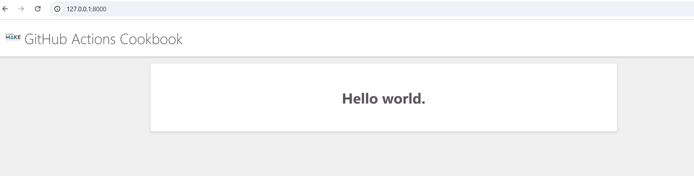
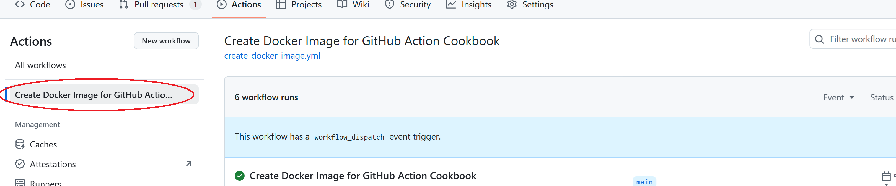
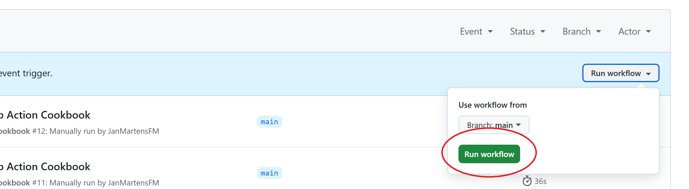
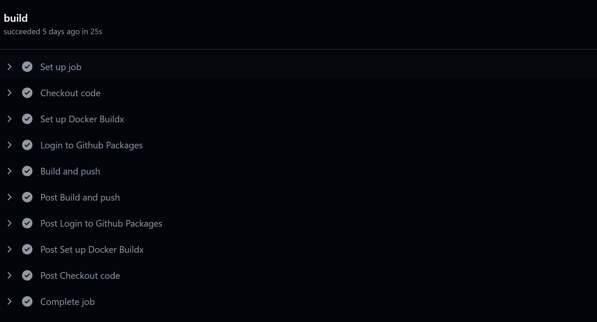
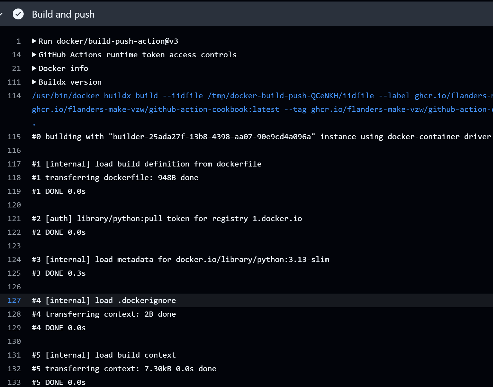
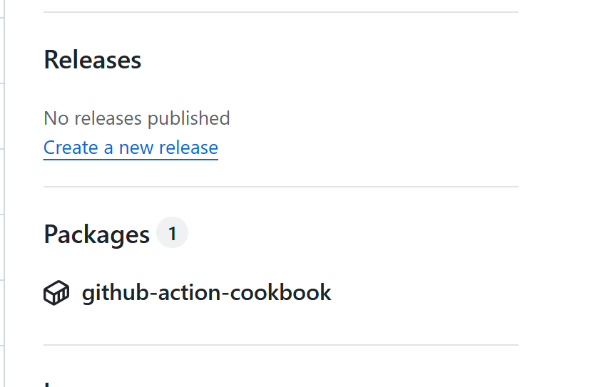

# GitHub Action for Creating and Publishing a Docker Image

This repository contains code and instructions on how to use a GitHub action to build and publish a docker image.


## Creating your first workflow which creates a Docker Image

This example illustrates how to setup your first workflow. It uses the code in this repository, and can be run in the repo as a test or as a fallback to see how the code works.

We suppose that you have an application that can be build and distributed using a Docker Image. If you want to know more about creating a Dockerfile and building a Docker Image, check out the documentation in [https://docs.docker.com/](https://docs.docker.com/).

Note the following files and folders in the application:

* dockerfile: the dockerfile configured for building and running this application. 
* requirements.txt: the file that specified the libraries to be used by the application. It is used in the dockerfile.
* hello_world_app: the django folder that contains the code for the web application.

If you run this docker image, you should get the following page if you navigate to [http://127.0.0.1:8000/](http://127.0.0.1:8000/): 




We will perform the following steps in this tutorial:

* Create a workflow that will package the application in a Docker Image, which will be hosted on ghrc.io.
* Run the workflow.
* Find the package.
* Create a docker-compose.yml file that uses the Docker Image.
* Logon to ghcr.io
* Run the docker-compose.yml file.


### Creating the workflow

In your repository, create a file called `.github\workflows\create-docker-image.yml`.

Copy the following code into this file:

```
name: Create Docker Image for <Name Of Application>

on: 
  workflow_dispatch:
  
env:
  IMAGE_NAME: 'ghcr.io/flanders-make-vzw/<Name Of Application Image>'

jobs:

  build:

    runs-on: ubuntu-latest
    permissions:
      contents: read
      packages: write

    steps:
    - name: Checkout code
      uses: actions/checkout@v4
      
    - name: Set up Docker Buildx
      uses: docker/setup-buildx-action@v2

    - name: Login to Github Packages
      uses: docker/login-action@v3
      with:
        registry: ghcr.io
        username: ${{ github.actor }}
        password: ${{ secrets.GITHUB_TOKEN  }}
      
    - name: Build and push
      uses: docker/build-push-action@v3
      with:
        context: .
        platforms: linux/amd64
        push: true
        tags:
          ${{ env.IMAGE_NAME }}:latest, ${{ env.IMAGE_NAME }}:1.0.0
        labels:
          ${{ env.IMAGE_NAME }}:1.0.0
```

Replace the following:

* \<Name Of Application> : This is will be shown in the label for the build when running the workflow.
* \<Name Of Application Image>: This is the name of the Docker Image. It will be shown in GitHub Packages and will be used in the docker-compose.yml.

Commit the file to GitHub so that it is available in your repository.

The workflow contains mostly setup steps. The main processing is done in the docker/build-push-action step. This will build the Docker Image based on the dockerfile. The dockerfile should be in the root directory of the repo, which is specified by the ```context``` setting of this action.

### Run the workflow

* Go to your repository in GitHub
* Click on the Actions tab
* In the left sidebar, click the workflow you want to display:




Execute the workflow by clicking on ```Run workflow```:



Your workflow should appear in the list (it may take some time before it starts running). By clicking on the workflow, and then build, you should be able to see the different steps which are being executed:



You can get more detail of certain step by clicking on it: 



### Find the package

When everything has executed succesfully, you should have create a package which contains the Docker Image. To find this package:

* Go back to the `code` tab of the repo.
* On the right side, you can find the package section:



* By clicking on your package, you can find more details, including instructions on how to pull the image. 

### Creating a docker-compose.yml file

### Logon to ghcr.io

### Run the docker-compose.yml

