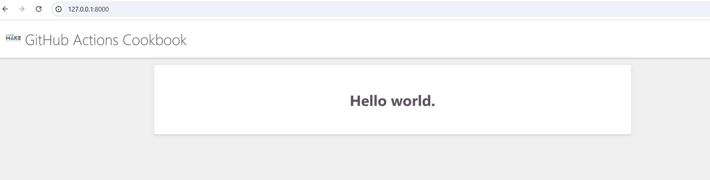
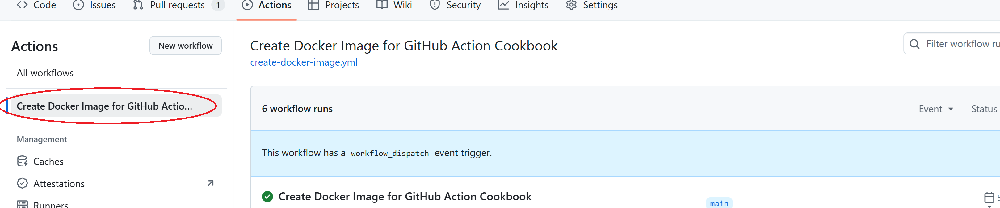
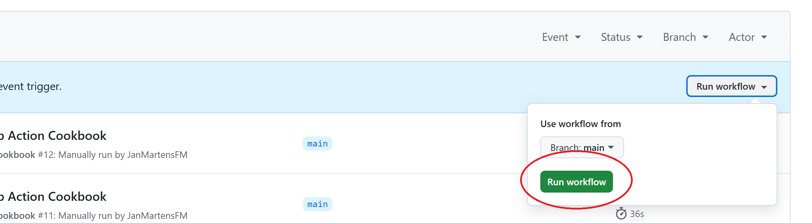
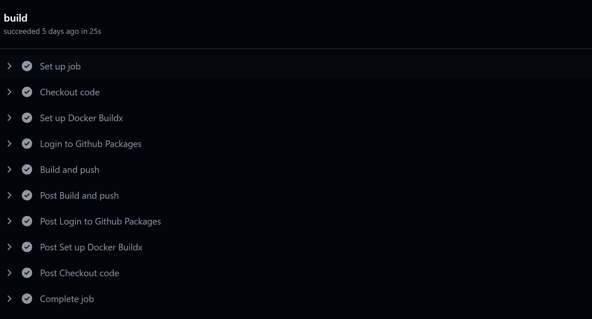
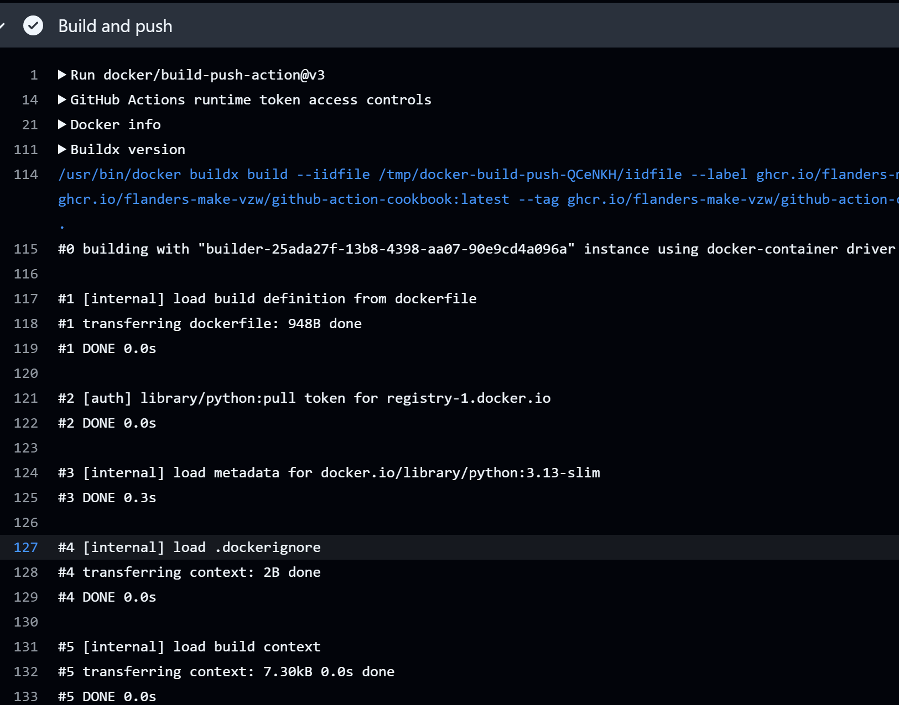

# GitHub Action for Creating and Publishing a Docker Image

This repository contains code and instructions on how to use a GitHub action to build and publish a docker image.


## Creating your first workflow which creates a Docker Image

This example illustrates how to setup your first workflow. It uses the code in this repository, and can be run in the repo as a test or as a fallback to see how the code works.

We suppose that you have an application that can be build and distributed using a Docker Image. If you want to know more about creating a Dockerfile and building a Docker Image, check out the documentation in [https://docs.docker.com/](https://docs.docker.com/).

Note the following files and folders in the application:

* dockerfile: the dockerfile configured for building and running this application. 
* requirements.txt: the file that specified the libraries to be used by the application. It is used in the dockerfile.
* hello_world_app: the django folder that contains the code for the web application.

If you run this docker image, you should get the following page if you navigate to [http://127.0.0.1:8000/](http://127.0.0.1:8000/): 




We will perform the following steps in this tutorial:

* Create a workflow that will package the application in a Docker Image, which will be hosted on ghrc.io.
* Run the workflow.
* Find the package.
* Create a docker-compose.yml file that uses the Docker Image.
* Logon to ghcr.io
* Run the docker-compose.yml file.


### Creating the workflow

In your repository, create a file called `.github\workflows\create-docker-image.yml`.

Copy the following code into this file:

```
name: Create Docker Image for <Name Of Application>

on: 
  workflow_dispatch:
  
env:
  IMAGE_NAME: 'ghcr.io/flanders-make-vzw/<Name Of Application Image>'

jobs:

  build:

    runs-on: ubuntu-latest
    permissions:
      contents: read
      packages: write

    steps:
    - name: Checkout code
      uses: actions/checkout@v4
      
    - name: Set up Docker Buildx
      uses: docker/setup-buildx-action@v2

    - name: Login to Github Packages
      uses: docker/login-action@v3
      with:
        registry: ghcr.io
        username: ${{ github.actor }}
        password: ${{ secrets.GITHUB_TOKEN  }}
      
    - name: Build and push
      uses: docker/build-push-action@v3
      with:
        context: .
        platforms: linux/amd64
        push: true
        tags:
          ${{ env.IMAGE_NAME }}:latest, ${{ env.IMAGE_NAME }}:1.0.0
        labels:
          ${{ env.IMAGE_NAME }}:1.0.0
```

Replace the following:

* \<Name Of Application> : This is will be shown in the label for the build when running the workflow.
* \<Name Of Application Image>: This is the name of the Docker Image. It will be shown in GitHub Packages and will be used in the docker-compose.yml.

Commit the file to GitHub so that it is available in your repository.

The workflow contains mostly setup steps. The main processing is done in the docker/build-push-action step. This will build the Docker Image based on the dockerfile. The dockerfile should be in the root directory of the repo, which is specified by the ```context``` setting of this action.

### Run the workflow

* Go to your repository in GitHub
* Click on the Actions tab
* In the left sidebar, click the workflow you want to display:




Execute the workflow by clicking on ```Run workflow```:



Your workflow should appear in the list (it may take some time before it starts running). By clicking on the workflow, and then build, you should be able to see the different steps which are being executed:



You can get more detail of certain step by clicking on it: 



### Find the package

When everything has executed succesfully, you should have create a package which contains the Docker Image. To find this package:

* Go back to the `code` tab of the repo.
* On the right side, you can find the package section:

<p align="center">

</p>

* By clicking on your package, you can find more details, including instructions on how to pull the image. 

### Creating a docker-compose.yml file

To use the image you just created, you can specify it in a `docker-compose.yml` file.

Create a `docker-compose.yml` file, and copy the following text into it:

```
services:

  django-web:
    image: ghcr.io/flanders-make-vzw/<Name Of Application Image>:latest

    container_name: github-action-cookbook
    ports:
      - "8000:8000"

```

Make sure to replace \<Name Of Application Image> by the application name that you used.

Note that the image is hosted on `ghcr.io`, which is the GitHub Container Reposity.

### Logon to ghcr.io

Before you can pull the image, you will need to logon to ghcr.io/flanders-make-vzw. To do this, you need to create a Personal Access Token (PAT):

* In GitHub, open the settings of your account, by clicking on the icon in the right top side, and clicking on `Settings`.
* Click on `Developer Settings` in the left menu.
* Open `Personal access tokens` and select `Tokens (classic)`.
* Click on `Generate new token` and `Generate new token (classic)`.
* Sign in to GitHub if requested.
* Enter a note for the PAT, so that you can identify it later on.
* Specify an expiration date. Make sure that this is well enough in the future. If you need to regenerate another token, you will need to copy it to all the locations where you used it.
* Make sure to select `read:packages` from the list of scopes. If you plan on also adding extra functionalities to the workflow, it's best to also select `write:packages`.
* Click on `Generate token` at the bottom of the page.

If the token was generated succesfully, you will get a page that shows it. It starts with "ghp_". **Make sure to copy the token, and store it in a safe location, like your KeePass or another vault. You will not be able to retrieve it otherwise.**

* Click on `Configure SSO` and authorize Flanders-Make-vzw.


You can find more information about Personal Access Tokens here: [https://docs.github.com/en/authentication/keeping-your-account-and-data-secure/managing-your-personal-access-tokens](https://docs.github.com/en/authentication/keeping-your-account-and-data-secure/managing-your-personal-access-tokens).


When you have create a PAT, execute the following command:

```docker login -u <GitHubUserId> -p <PatToken> ghcr.io/flanders-make-vzw```

Replace \<GitHubUserId> by you GitHub UserId, and \<PatToken> by the PAT token you just created.

You should get a message saying that you succesfully logged on to ghcr.io. 


### Run the docker-compose.yml

Running the `docker-compose.yml` is done in the same way as for any `docker-compose.yml` file:

* Go to the folder that contains you `docker-compose.yml` file.
* Execute `docker compose up`.


# DevContainers

Dockers can also be used to setup a development environment, so that we can ensure that it's easy to setup a new development environment, but also to ensure that everyone is using the same environment and libraries. You can find more about DevContainers in [https://github.com/Flanders-Make-vzw/DevContainerCookbook](https://github.com/Flanders-Make-vzw/DevContainerCookbook).


